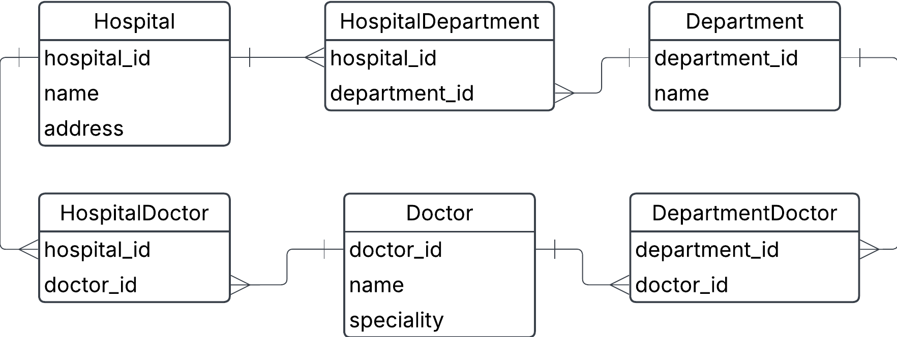

## 0. Hospital Example

### Going back to the hospital exercise from exercise0, task 1, we will build logical and physical data models. This is the conceptual data model after we've added the composite entities to take care of many-to-many relationships.

a) Create a logical data model using lucidcharts



b) Identify different keys on the various entities

| entity             | primary_key                | foreign_key(s)             |
|--------------------|----------------------------|----------------------------|
| Hospital           | hospital_id                | -                          |
| Department         | department_id              | -                          |
| Doctor             | doctor_id                  | -                          |
| HospitalDepartment | -                          | hospital_id, department_id | 
| DeparmentDoctor    | -                          | department_id, doctor_id   |
| HospitalDoctor     | -                          | doctor_id, hospital_id     |

c) Identify child entities and parent entities. What makes them into parent/child relationships?

Parent Entities:

    1. Hospital
    2. Department
    3. Doctor

Child Entities (composite tables):

    1. HospitalDepartment (join table)
    2. DepartmentDoctor (join table)
    3. HospitalDoctor (join table)

A parent provides a primary key.

A child (composite entity) holds foreign keys, referencing two parent entities.

The child's existence depends on the referenced parent(s).

d) Create a physical data model using dbdiagram

```sql
Table Hospital {
  hospital_id INTEGER [primary key]
  name VARCHAR [not null]
  address VARCHAR [not null]
}

Table Department {
  department_id INTEGER [primary key]
  name VARCHAR [not null]
}

Table Doctor {
  doctor_id INTEGER [primary key]
  name VARCHAR [not null]
  specialty VARCHAR [not null]
}

Table HospitalDepartment {
  hospital_id INTEGER [not null, ref: > Hospital.hospital_id]
  department_id INTEGER [not null, ref: > Department.department_id]
}

Table DepartmentDoctor {
  department_id INTEGER [not null, ref: > Department.department_id]
  doctor_id INTEGER [not null, ref: > Doctor.doctor_id]
}

Table HospitalDoctor {
  doctor_id INTEGER [not null, ref: > Doctor.doctor_id]
  hospital_id INTEGER [not null, ref: > Hospital.hospital_id]
}
```

e) Create a few tables manually, insert given data plus some more, and try to manually link foreign keys to primary keys. Can you satisfy that a doctor can work at several departments and several hospitals?

```sql
-- Parent Tables:
-- Hospital
INSERT INTO Hospital VALUES (1, 'City Hospital', '123 Main St');
INSERT INTO Hospital VALUES (2, 'Valley Hospital', '456 River Rd');

-- Department
INSERT INTO Department VALUES (1, 'Cardiology');
INSERT INTO Department VALUES (2, 'Neurology');

-- Doctor
INSERT INTO Doctor VALUES (1, 'Dr. Alice', 'Cardiologist');
INSERT INTO Doctor VALUES (2, 'Dr. Bob', 'Neurologist');

-- Join Tables:
-- HospitalDepartment: Cardiology exists in both hospitals
INSERT INTO HospitalDepartment VALUES (1, 1);
INSERT INTO HospitalDepartment VALUES (2, 1);

-- DepartmentDoctor: Dr. Alice and Dr. Bob are in Cardiology and Neurology
INSERT INTO DepartmentDoctor VALUES (1, 1); -- Dr. Alice in Cardiology
INSERT INTO DepartmentDoctor VALUES (2, 2); -- Dr. Bob in Neurology
INSERT INTO DepartmentDoctor VALUES (1, 2); -- Dr. Bob also in Cardiology

-- HospitalDoctor: Dr. Alice works at both hospitals
INSERT INTO HospitalDoctor VALUES (1, 1);
INSERT INTO HospitalDoctor VALUES (2, 1);
```

A doctor can work at multiple hostials (HospitalDoctor)
A doctor can work at multiple departments (DepartmentDoctor)
A department can exist in multiple hospitals (HospitalDepartment)